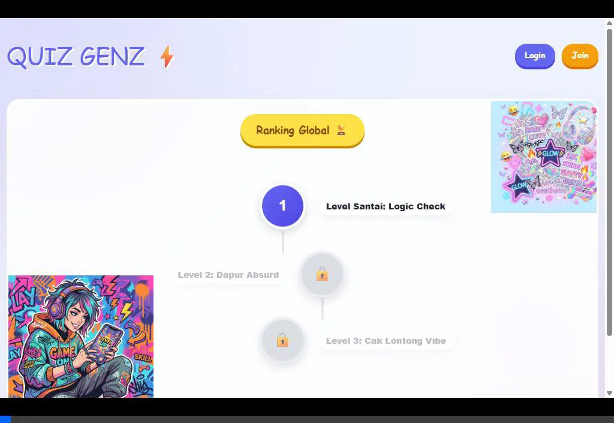
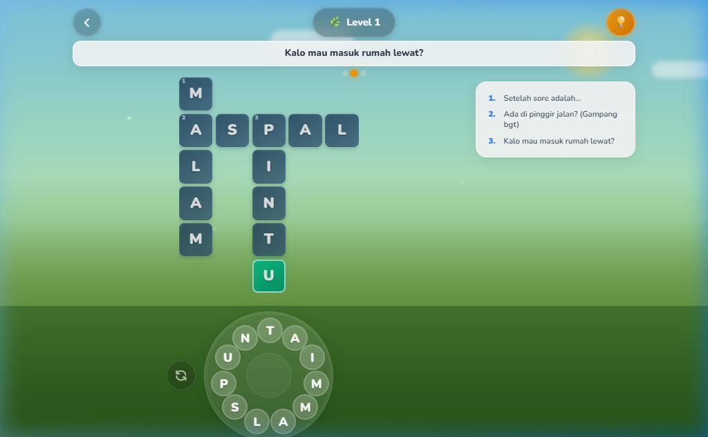
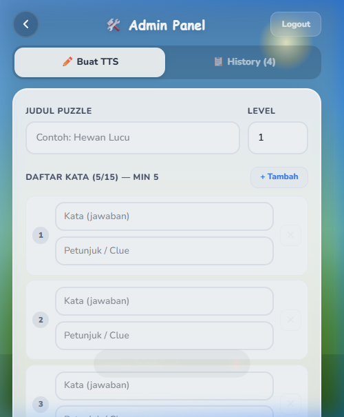

# 🧩 TTS Quest (Quiz GenZ)


**TTS Quest** adalah permainan Teka-Teki Silang (TTS) modern berbasis web SPA (Single Page Application) yang sangat interaktif dan responsif untuk mobile maupun desktop. 

Aplikasi ini dibuat sebagai pemenuhan tes *Software Engineer*, mencakup **Admin Panel** (TTS Creator) dengan algoritma *auto-crossword generator* di sisi client, dan **Player Dashboard** yang meniru *feel* game puzzle native populer (seperti Wordscapes) dengan fitur *word wheel swipe*, input keyboard cerdas, *timer*, dan *hint system*.

---

## ✨ Fitur Utama (Sesuai Requirement)

### 1. TTS Creator / Admin Panel (Khusus Role Admin)
- 📝 Form input dinamis untuk **Kata** dan **Clue** (Min. 5 kata, Maks. 15 kata).
- 🧠 **Algoritma Generator Otomatis:** Sistem secara pintar akan menyusun papan kotak saling silang (intersection) jika ada huruf yang sama antar kata.
- 👁️ **Live Visual Preview:** Admin bisa melihat bentuk grid sebelum disimpan ke database.
- 💾 Kemampuan *Publish* puzzle dan tab **History** berisi daftar TTS yang pernah dibuat.

### 2. TTS Player (Gameplay User)
- 🎮 Grid interaktif yang menyesuaikan ukuran layar secara otomatis (responsive).
- 📲 **Dua Mode Input:** 
  1. Melingkar (*Word Wheel* gaya Wordscapes) yang bisa di-**swipe**.
  2. Input **Keyboard** konvensional dengan *auto-advance focus* ke kotak berikutnya.
- 📜 Daftar *clue/petunjuk* yang interaktif (tercoret otomatis saat kata terjawab).
- 🏆 Visual *feedback* seketika (kotak menyala emas saat jawaban benar secara instan).
- 🔔 *Win Modal Notification* lengkap dengan catatan Waktu (Timer) dan Bintang (Score).

### 3. Akses & Berbagi Puzzle (Shareable)
- 🔗 Tiap puzzle memiliki susunan *routing URL unik* (contoh: `/play/1`, `/play/2`).
- 🔓 Puzzle **terbuka untuk publik** (bisa diakses dan dimainkan tanpa perlu registrasi/login).
- 🗺️ Halaman beranda (*Home*) yang menyajikan roadmap *level selection* interaktif berurut.

### 4. Extra Feature (Nilai Tambah UI/UX)
- 💡 **Sistem Bantuan (Hint):** Tombol bohlam untuk menyingkap satu huruf acak (dibatasi **2x hint per level**).
- ⏳ **Stopwatch Timer:** Menghitung total durasi penyelesaian level.
- 🔄 **Shuffle Wheel:** Tombol untuk mengacak tata letak huruf di roda swipe.
- 🔐 **Pita Keamanan Role-Based:** Pengguna biasa (Player) terblokir ketat (*HTTP 403*) jika mencoba mengakses endpoint atau page Panel Admin, dicegah sejak lapis Backend Middleware (*Sanctum*).
- 🔊 **Sound Effects:** Efek suara interaktif menggunakan Web Audio API (tanpa file eksternal) - bunyi saat swipe huruf, jawaban benar, dan level selesai.
- 🌙 **Dark Mode:** Toggle tema gelap/terang dengan transisi halus, preferensi tersimpan di localStorage.
- 📤 **Share to Social Media:** Bagikan pencapaian level ke media sosial atau copy ke clipboard dengan URL game.
- 🔁 **Replay Level:** Tombol untuk mengulang level dari awal setelah menang.
- 🛡️ **Leaderboard Security:** Validasi server-side untuk mencegah score cheating (verifikasi jawaban, validasi waktu minimum).
- 👤 **Guest vs User Progress:** Pemisahan sistem progress - tamu menggunakan localStorage, user login menggunakan database.

---

## 📸 Screenshots Demo

<div align="center">
  
  
  
</div>

> *Screenshot asli tersimpan di folder `/public/screenshots/` (Jika gambar rusak saat dibaca di local markdown reader).*

---

## 🎬 Video Demo

> 📹 **Video demo tersedia di folder `public/screenshots/demo-video.mp4`** (tidak di-upload ke GitHub karena ukuran file > 100MB).
> 
> Untuk melihat demo, clone repository dan buka file video secara lokal, atau hubungi developer untuk link Google Drive/YouTube.

---

## 🚀 Tech Stack & Arsitektur

- **Backend / API Server:** Laravel 11 (PHP 8.2+), ekosistem REST API.
- **Database:** SQLite (Default, sangat *portable* tidak butuh install MySQL/MariaDB daemon untuk mereview).
- **Authentication:** Laravel Sanctum (Token-Based dengan *Role Differentiation*: `auth_token` vs `admin_token`).
- **Frontend / Client:** React 18, React Router DOM v6, Axios.
- **Styling:** *Vanilla CSS Custom* murni (Gaya *Glassmorphism*, gradien warna dinamis, dan keyframes micro-animation) di dalam file tunggal `app.css`. Tanpa bloated utility framework.
- **Build Tool:** Vite.js.

---

## 🛠️ Panduan Instalasi & Menjalankan di Lokal

### Prasyarat:
- **PHP 8.2** atau lebih baru.
- **Composer** (PHP Package Manager).
- **Node.js** (v18+) dan **npm**.

### Langkah-langkah:

**1. Clone atau Ekstrak Repository Project**
Jalankan perintah clone berikut di Terminal/Command Prompt untuk mengunduh source code (atau sedot via file .zip):
```bash
git clone https://github.com/adnanarfansyahwork-blip/TTS-Game.git
cd TTS-Game
```

**2. Setup Backend (Laravel)**
Jalankan perintah berikut berurutan di terminal:
```bash
composer install
cp .env.example .env     # (Windows CMD: copy .env.example .env)
php artisan key:generate
```

**3. Migrasi Database dan Data Awal (Wajib!)**
Sebelum melakukan migrasi, pastikan file database SQLite telah dibuat karena file ini di-ignore oleh Git. Jalankan perintah berikut untuk membuat file database kosong (atau Anda bisa membuat file `database.sqlite` secara manual di dalam folder `database/`):
```bash
# Untuk Mac/Linux/Git Bash:
touch database/database.sqlite

# Untuk Windows (CMD/PowerShell):
type NUL > database\database.sqlite
```
Setelah file database berhasil dibuat, jalankan perintah migrasi beserta Seeder untuk membuat akun *Admin* dan men-generate sampel puzzle *Level 1-3*:
```bash
php artisan migrate:fresh --seed
```
*Akun Administrator yang digenerate:*
- **Email:** `admin@admin.com`
- **Password:** `password123`

**4. Setup Frontend (React / Vite)**
Pada terminal yang sama (atau tab terminal baru), install library javascript:
```bash
npm install
```

**5. Menjalankan Development Server**
Karena ini menggunakan Laravel + Vite secara bersamaan, buka **2 jendela terminal terpisah** di dalam folder project:

- **Terminal 1 (Menjalankan API Server):**
  ```bash
  php artisan serve
  ```
- **Terminal 2 (Menjalankan Frontend Asset Bundler):**
  ```bash
  npm run dev
  ```

Akses App di Browser: **[http://127.0.0.1:8000](http://127.0.0.1:8000)**

*(Catatan: Anda sudah bisa langsung menekan tombol "Level 1" di halaman utama tanpa perlu login untuk mencoba sistemnya).*

---

## 📂 Struktur Penting Direktori Aplikasi

Project ini mengikuti Standar Monolith SPA Laravel 11 terbaru:
- `/routes/api.php` ➔ Jalur routing REST API backend beserta proteksi *middleware* otorisasi admin.
- `/app/Http/Controllers/` ➔ Terdapat `PuzzleController.php` (menangani database TTS) dan `AuthController.php` (login/token logic).
- `/database/seeders/DatabaseSeeder.php` ➔ Data susunan array matriks awal Grid contoh TTS untuk memperlancar proses testing Anda.
- `/resources/js/` ➔ **Pusat Frontend React**, berisi pages *SPA*.
- `/resources/js/lib/crosswordGenerator.js` ➔ **CORE ALGORITHM**. Source code utama dari otak matematis yang mengatur logika intersection (*persinggungan tata letak*) generator papan TTS secara prosedural.
- `/resources/js/lib/sounds.js` ➔ **Sound Manager** menggunakan Web Audio API untuk efek suara programatik.
- `/resources/js/lib/theme.js` ➔ **Theme Manager** untuk fitur Dark Mode dengan persistensi localStorage.
- `/resources/css/app.css` ➔ Sumber UI/UX (Desain *Grassland/Meadow* kekinian dengan dukungan Dark Mode).
- `/ALGORITHM_DOCS.md` ➔ Lembar lampiran khusus yang membahas bedah algoritma `crosswordGenerator.js` dan laporan Bugfix selama development test ini.
